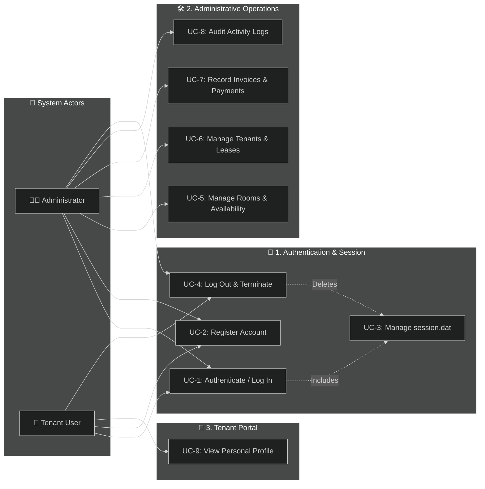
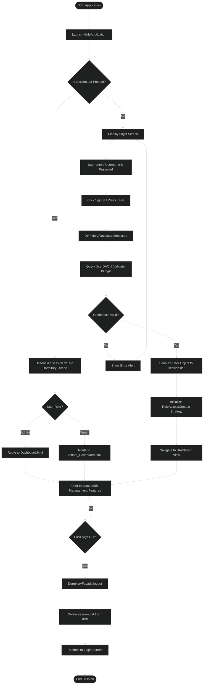
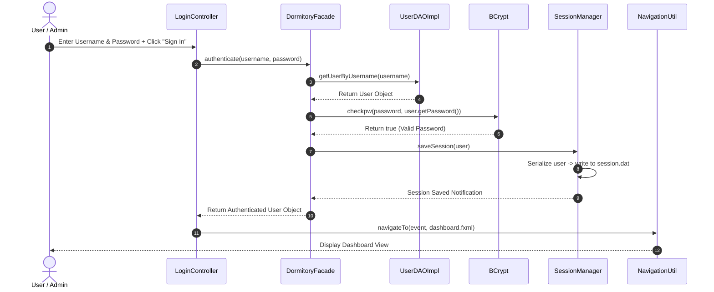

# BoreDorm Management System

BoreDorm is a modern, comprehensive dormitory management software system designed to streamline administrative operations and elevate the tenant experience. It provides features for administrators to manage rooms, monitor tenants, track billing, and review logs, while offering tenants a dedicated dashboard to view their lease details and billing status.

---

## 📊 System UML Diagrams

The system architecture and behavioral flows are modeled below using standardized UML diagrams (Class, Use Case, Activity, and Sequence Diagrams). All diagrams are configured with **straight, orthogonal lines** and structured modular layouts for maximum visual clarity and clean formatting.

> **Tip for app.diagrams.net (Draw.io):** You can open [app.diagrams.net](https://app.diagrams.net), click **Arrange > Insert > Advanced > Mermaid**, paste any of the Mermaid code blocks below, and Draw.io will automatically generate perfectly aligned, straight-line vector graphics!

### 1. 📑 Class Diagram (System Architecture & Design Patterns)

```mermaid
%%{init: {'theme': 'dark', 'flowchart': {'curve': 'straight'}, 'class': {'curve': 'straight'}}}%%
flowchart TD
    subgraph Tier1["Layer 1: Presentation & Startup Controllers"]
        HelloApp["HelloApplication"]
        LoginCtrl["LoginController"]
        DashCtrl["DashboardController"]
        TenantDashCtrl["TenantDashboardController"]
    end

    subgraph Tier2["Layer 2: Structural Facade & Strategy Context"]
        Facade["🏛️ DormitoryFacade<br><i>(Structural Facade)</i>"]
        StrategyCtx["🎯 RoleAccessContext<br><i>(Behavioral Context)</i>"]
    end

    subgraph Tier3["Layer 3: Behavioral Permission Strategies"]
        IRoleStrat["<<interface>><br>RoleAccessStrategy"]
        AdminStrat["AdminAccessStrategy"]
        TenantStrat["TenantAccessStrategy"]
    end

    subgraph Tier4["Layer 4: Data Access & Session Management"]
        ISessionMgr["<<interface>><br>ISessionManager"]
        SessionMgr["💾 SessionManager<br><i>(Singleton / Serialization)</i>"]
        IUserDAO["<<interface>><br>UserDAO"]
        UserDAOImpl["UserDAOImpl"]
    end

    subgraph Tier5["Layer 5: Creational Factory & Model Entities"]
        UserFactory["🏭 UserFactory<br><i>(Creational Factory)</i>"]
        ISerializable["<<interface>><br>Serializable"]
        UserModel["User"]
        TenantModel["Tenant"]
        ActivityLogModel["ActivityLog"]
    end

    HelloApp ---> Facade
    LoginCtrl ---> Facade
    DashCtrl ---> Facade
    TenantDashCtrl ---> Facade

    Facade ---> SessionMgr
    Facade ---> IUserDAO
    Facade ---> UserFactory
    Facade ---> StrategyCtx

    StrategyCtx ---> IRoleStrat
    IRoleStrat <|--- AdminStrat
    IRoleStrat <|--- TenantStrat

    ISessionMgr <|--- SessionMgr
    IUserDAO <|--- UserDAOImpl

    UserFactory ..-> UserModel
    ISerializable <|--- UserModel
```

---

### 2. 🎯 Use Case Diagram (System Interaction & Boundaries)



---

### 3. 🔄 Activity Diagram (Authentication & Session Lifecycle)



---

### 4. ⏱️ Sequence Diagram (User Login & Session Creation Flow)



---

## 🌟 Major Features

1. **User Authentication & Authorization**: Role-based access control (RBAC) separating Admin and Tenant permissions.
2. **Interactive Room Directory**: Graphical and searchable view of dormitory rooms grouped by floors, tracking room types, rates, capacity, and current availability status.
3. **Tenant & Lease Tracking**: Managed list of all active tenants, room numbers, and lease status.
4. **Billing & Invoice Logging**: Easy entry of tenant invoices and payment posting via multiple channels (GCash, Bank Transfer, Cash, Credit Card).
5. **Real-time Activity Logs**: Live dashboard feed logging system audits and check-in activities.
6. **Tenant Portal**: Dedicated interface for occupants to verify their registered room profile, roommate info, and lease conditions.

---

## 📐 Software Design Patterns Implemented

The system incorporates **Creational**, **Structural**, and **Behavioral** software design patterns to achieve clean architecture, high maintainability, and loose coupling.

### 1. 🏭 Creational Pattern: Factory Method Pattern
* **Class Involved**: `UserFactory` (`com.boredom.boredorm.Factory.UserFactory`)
* **Implementation**: Encapsulates the instantiation of `User` objects across different user roles (`Admin` vs `Tenant`). Provides specialized static factory methods like `createTenant()` and `createAdmin()` to enforce default values (e.g., initial `"Unassigned"` room numbers and `"Pending"` lease statuses for new tenants).
* **Benefits**: Centralizes object creation logic. Controllers do not need to hardcode constructor default parameters, preventing duplicate initialization logic.

### 2. 🏛️ Structural Pattern: Facade Pattern
* **Class Involved**: `DormitoryFacade` (`com.boredom.boredorm.Facade.DormitoryFacade`)
* **Implementation**: Provides a unified, high-level interface to the complex subsystem of DAOs (`UserDAO`), Password Hashing (`BCrypt`), Session Serialization (`SessionManager`), and Permission Strategies (`RoleAccessContext`).
* **Benefits**: Simplifies controller implementations. `LoginController` and `RegisterController` interact with a single `DormitoryFacade.getInstance().authenticate()` or `registerTenant()` method rather than orchestrating multi-step database and security calls manually.

### 3. 🎯 Behavioral Pattern: Strategy Pattern
* **Classes & Interfaces Involved**:
  * Interface: `RoleAccessStrategy` (`com.boredom.boredorm.Strategy.RoleAccessStrategy`)
  * Concrete Strategies: `AdminAccessStrategy` and `TenantAccessStrategy`
  * Context: `RoleAccessContext` (`com.boredom.boredorm.Strategy.RoleAccessContext`)
* **Implementation**: Encapsulates role-based access control algorithms and UI permission rules. The `RoleAccessContext` dynamically instantiates and delegates access control checks to either `AdminAccessStrategy` or `TenantAccessStrategy` based on the logged-in user's role.
* **Benefits**: Eliminates monolithic `if-else` conditional chains for permission checking across views. New roles (e.g., `StaffAccessStrategy`) can be introduced without modifying existing controller logic.

---

## 💾 Java Serialization Session Management

To validate and maintain session state across the JavaFX application, we implemented a persistent session management system using **Java Object Serialization**:

* **Session File Creation**: Upon a successful login, the user's `User` model (which implements `java.io.Serializable`) is serialized and written to a file named `session.dat` in the user's home directory.
* **Session Persistence**: While navigating through the application's screens, the controllers load and deserialize `session.dat` to confirm authentication and retrieve role/profile details dynamically.
* **Session Termination (Logout)**: Clicking the sign-out option triggers the automatic deletion of the physical `session.dat` file from the disk via `DormitoryFacade`, clearing the active session and redirecting the user back to the login screen.
* **Launch Security**: During application startup, `HelloApplication` uses `DormitoryFacade` to scan for `session.dat`. If a valid session file is found, it automatically bypasses the login screen and routes the user directly to their respective dashboard interface.

---

## 🏗️ SOLID Design Principles Applied

### 1. Single Responsibility Principle (SRP)
* **Classes Involved**: `SessionManager` (`com.boredom.boredorm.SessionManaging`) and `User` (`com.boredom.boredorm.Models`).
* **Implementation**: `SessionManager` is solely responsible for the lifecycle of the session file (`session.dat`) on disk (creating, reading, verifying, and deleting it). It does not handle database querying or page navigation. The `User` class is a pure data carrier.
* **Benefit**: High maintainability. If the session storage format changes (e.g., from local file to database or encrypted registry), only the `SessionManager` code is modified, without breaking user models or database access logic.

### 2. Dependency Inversion Principle (DIP)
* **Classes & Interfaces Involved**: `ISessionManager` interface and `SessionManager` concrete implementation.
* **Implementation**: Controllers interact with the session management mechanism through the `ISessionManager` interface rather than directly instantiating or depending on a concrete implementation.
* **Benefit**: Weak coupling. This separates page navigation and presentation concerns from session management mechanisms. It also allows developers to easily mock sessions for testing or swap implementations entirely.

---

## 🔑 Test Accounts (for Sir Serato)

Use these credentials to test the system:

### 👤 Admin Access
* **Username**: `JayVinceAdmin`
* **Password**: `Serato.123456`

### 👥 Tenant Access
* **Username**: `JayVinceUser`
* **Password**: `User.123456`

---
*Developed as a Capstone Project for Software Engineering and Architecture.*
